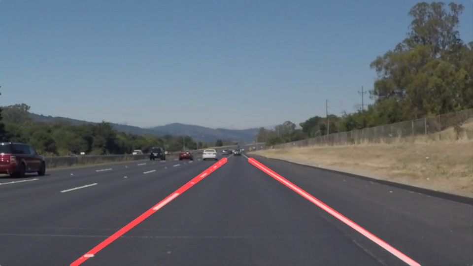

# **Udacity - Self-Driving Car NanoDegree - Finding Lane Lines on the Road** 

Overview
---

This repository is to submit the project of [Udacity - Self-Driving Car NanoDegree - Finding Lane Lines on the Road](https://github.com/udacity/CarND-LaneLines-P1).

**Finding Lane Lines on the Road**

The goals / steps of this project are the following:

* Make a pipeline that finds lane lines on the road by using Canny edge detection and Hough Transform of OpenCV.

Outcome
---

1. README (.md)
2. Code : [P1.ipynb](P1.ipynb) (Ipython notebook)
3. [Writeup Report](writeup.md) (.md)

LICENSE
---

MIT License
